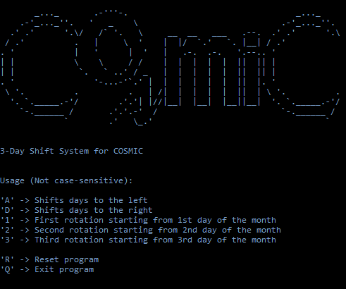

# ShiftCalendar
3-Day Shift Calendar with SDL2 in Nim

# 

## Building

`nimble build` or `nim -d:release c calendar` both build a `calendar`
binary file based on the host OS.

## Dependencies

- Requires .ttf (font) file and .jpg (background) file within the same directory as built binary file.
- Imports SDL2, SDL2_image, SDL2_ttf and stopwatch
	- If SDL2 dependencies faults at execution, interchange between x86 and x64 SDL2 dlls to find the correct dlls used in execution
